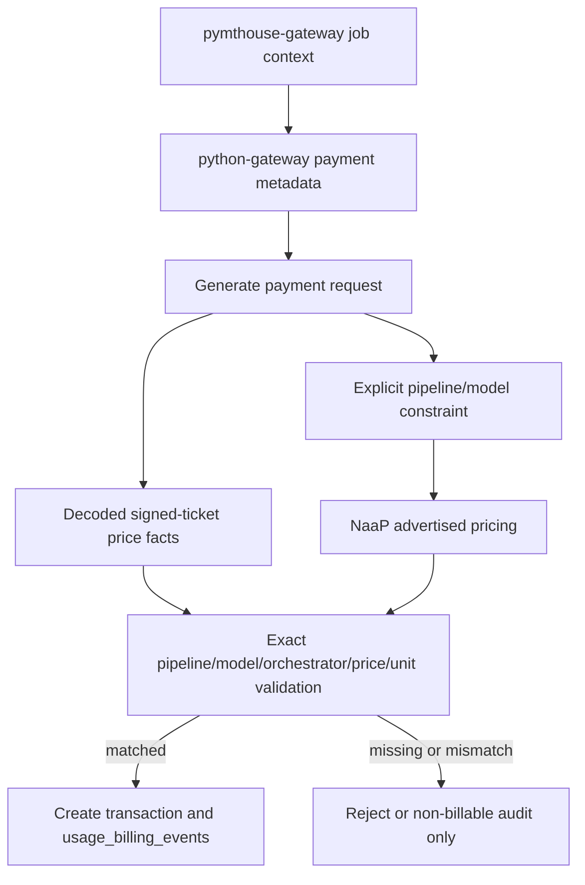

# Plan Billing and ETH/USD Oracle

## Research Summary

PymtHouse already has the right entry points, but today they are only partially connected:

- Runtime network metering happens in [`src/lib/signer-proxy.ts`](src/lib/signer-proxy.ts). `proxyGenerateLivePayment()` decodes the orchestrator `pricePerUnit`/`pixelsPerUnit`, computes `feeWei`, forwards the unchanged body to the signer, then writes `stream_sessions`, `transactions`, and `usage_records` only after a successful signer response.
- `transactions.amount_wei` is the network usage ledger today. `platform_cut_percent` and `platform_cut_wei` are stored, but invoices do not yet clearly separate developer-owner cost from app-owner-to-end-user retail billing.
- `usage_records` are the better anchor for end-user billing. For JWT app-user flows, `transactions.end_user_id` is often `null`, while `usage_records.user_id` contains the app user id used by the Usage API and billing UI.
- Plans exist in [`src/db/schema.ts`](src/db/schema.ts), [`src/app/api/v1/apps/[id]/plans/route.ts`](src/app/api/v1/apps/[id]/plans/route.ts), and [`src/app/apps/[id]/plans/page.tsx`](src/app/apps/[id]/plans/page.tsx), but they currently use unit/wei fields (`includedUnits`, `overageRateWei`) and free-text pipeline/model input.
- The live NaaP catalog endpoint returns `{ id, name, models, regions }[]`. The pricing endpoint returns per-orchestrator rows: `orchAddress`, `orchName`, `pipeline`, `model`, `priceWeiPerUnit`, `pixelsPerUnit`, `isWarm`.
- Livepeer NaaP PR #283 supports an ETH/USD oracle based on public exchanges, not CoinGecko or Chainlink. Its server-side order is fresh cache, Binance `ETHUSDT`, Kraken `XETHZUSD`, stale cache, then `ETH_USD_PRICE` env/default `3000`.
- [`../pymthouse-gateway`](../pymthouse-gateway) will be the PymtHouse-facing client for this flow and can provide the strongest practical application/job context for usage attribution.
- [`../python-gateway`](../python-gateway) is the preferred place for core payment request changes, because it is the reusable gateway library that should carry canonical billing metadata into PymtHouse.
- [`../go-livepeer`](../go-livepeer) remote signer changes should not be required for the first implementation. The signer may continue signing price/payment facts without signing pipeline/model metadata, while PymtHouse validates attribution by comparing the signed ticket price against the advertised price for the gateway-supplied pipeline/model constraint.

## Product Semantics

- Developer app owners define plans for their users:
  - `subscription`: includes a USD amount of usage for the billing cycle.
  - `free`: no subscription credits; may still fall back to pay-per-use when no credits are active.
  - `usage`: pay-per-use pricing.
- Developer app owners can set one general positive upcharge percentage for all app usage.
- Developer app owners can set pipeline/model-specific positive upcharge percentages. These override the general upcharge for matching requests/sessions.
- Every billable signing transaction must be attributable to a specific pipeline/model constraint that PymtHouse can validate. Client-supplied pipeline/model labels are input, not proof.
- PymtHouse trusts the pipeline/model attribution only after the signed ticket price and unit size match the advertised NaaP price for that exact pipeline/model constraint, including the orchestrator where pricing is orchestrator-specific.
- `pymthouse-gateway` should supply the job/application context, and `python-gateway` should carry the canonical pipeline/model constraint through the payment request. PymtHouse should not depend on `go-livepeer` remote signer support for signed metadata in v1.
- End-user billable amount is derived from network price in USD multiplied by the selected upcharge.
- Developer app owners are billed separately at network price plus the PymtHouse platform fee from remote signer admin config.
- Invoices and usage APIs should make the platform fee transparent.
- Usage APIs must expose pipeline/model usage and ETH/USD amounts, not only application/user totals.

## Data Model Changes

Add a Drizzle migration and schema updates in [`src/db/schema.ts`](src/db/schema.ts).

### ETH/USD and Owner Ledger

Extend `transactions` so every usage transaction can preserve transaction-time valuation:

- `pipeline`: text, validated pipeline id for the signed job.
- `modelId`: text, validated model id for the signed job.
- `attributionSource`: text, e.g. `pymthouse_gateway`, `python_gateway`, `direct_api`, so reporting can distinguish trusted gateway-originated usage from direct integrations.
- `gatewayRequestId`: nullable text request/job id from `pymthouse-gateway` or `python-gateway` when available.
- `paymentMetadataVersion`: nullable text version for the metadata contract carried by `python-gateway`.
- `pipelineModelConstraintHash`: text, deterministic hash of `{ pipeline, modelId, orchAddress, priceWeiPerUnit, pixelsPerUnit }` used to validate this signed ticket.
- `advertisedPriceWeiPerUnit`: text integer from NaaP pricing for the validated pipeline/model/orchestrator constraint.
- `advertisedPixelsPerUnit`: text integer from NaaP pricing for the validated pipeline/model/orchestrator constraint.
- `signedPriceWeiPerUnit`: text integer decoded from the ticket signing request.
- `signedPixelsPerUnit`: text integer decoded from the ticket signing request.
- `priceValidationStatus`: text enum-like value, initially `matched`; use `missing_constraint`, `unknown_pipeline_model`, `missing_advertised_price`, or `price_mismatch` only for non-billable audit records if we intentionally keep rejected attempts.
- `priceValidationReason`: nullable text with a compact diagnostic for rejected/non-billable attempts.
- `ethUsdPrice`: text, decimal USD per 1 ETH from the oracle.
- `ethUsdSource`: text, e.g. `cache`, `binance`, `kraken`, `stale_cache`, `env`, `default`.
- `ethUsdObservedAt`: text timestamp from the oracle observation.
- `networkFeeUsdMicros`: bigint or text integer, computed from existing `amountWei`.
- `ownerPlatformFeeWei`: text integer, from existing `platformCutWei`.
- `ownerPlatformFeeUsdMicros`: bigint/text integer.
- `ownerChargeWei`: text integer = `amountWei + platformCutWei`.
- `ownerChargeUsdMicros`: bigint/text integer.

Keep `amountWei` and `platformCutWei` as the canonical wei facts so existing stream/session analytics keep working.

### Retail Billing Events

Add a new `usage_billing_events` table rather than overloading `transactions`:

- `id`
- `usageRecordId` nullable FK-like reference to `usage_records.id`
- `transactionId` nullable FK-like reference to `transactions.id`
- `streamSessionId`
- `clientId`
- `userId` from `usage_records.user_id`
- `planId` nullable
- `subscriptionId` nullable
- `pipeline`: validated pipeline id, never an unvalidated client label.
- `modelId`: validated model id, never an unvalidated client label.
- `attributionSource`
- `gatewayRequestId`
- `paymentMetadataVersion`
- `pipelineModelConstraintHash`
- `orchAddress`
- `advertisedPriceWeiPerUnit`
- `advertisedPixelsPerUnit`
- `signedPriceWeiPerUnit`
- `signedPixelsPerUnit`
- `networkFeeWei`
- `networkFeeEth`: derived decimal string for API/reporting convenience, or derive at read time from wei if preferred.
- `networkFeeUsdMicros`
- `platformFeeWei`
- `platformFeeEth`: derived decimal string for API/reporting convenience, or derive at read time from wei if preferred.
- `platformFeeUsdMicros`
- `ownerChargeWei`
- `ownerChargeEth`: derived decimal string for API/reporting convenience, or derive at read time from wei if preferred.
- `ownerChargeUsdMicros`
- `upchargePercentBps`
- `pricingRuleSource`: `pipeline_model`, `general`, `pay_per_use`, `subscription_included`, `unpriced`
- `endUserBillableUsdMicros`
- `ethUsdPrice`, `ethUsdSource`, `ethUsdObservedAt`
- `createdAt`

Indexes:

- unique on `usageRecordId` where not null, preserving the current request-id dedupe behavior.
- `(clientId, createdAt)` for billing summaries.
- `(clientId, userId, createdAt)` for per-user summaries.
- `(clientId, pipeline, modelId, createdAt)` for pipeline/model usage summaries.
- `(streamSessionId, createdAt)` for stream drilldowns.

### Plan Fields

Extend `plans`:

- `includedUsdMicros`: subscription included usage allowance.
- `generalUpchargePercentBps`: app-owner default positive upcharge for retail usage.
- `payPerUseUpchargePercentBps`: optional explicit fallback for free/no-credit users; if unset, use general upcharge.
- `billingCycle`: default `monthly`, matching current calendar month subscription periods.

Extend `plan_capability_bundles`:

- `upchargePercentBps`: positive pipeline/model-specific override.
- keep `pipeline` and `modelId`.
- keep `maxPricePerUnit` only if it remains useful as a UI guardrail, but do not use it as the primary retail billing rule.
- require saved bundle `pipeline`/`modelId` values to exist in the NaaP catalog at write time when the catalog is available.

Add a small price-cache table unless reusing an existing table becomes cleaner:

- `price_oracle_snapshots`: `id`, `symbol`, `priceUsd`, `source`, `fetchedAt`, `createdAt`.
- unique or dedupe index on `(symbol, fetchedAt)`.

## Oracle Design

Use the oracle supported by `livepeer/naap` PR #283.

Implement [`src/lib/prices/public-exchange-spot.ts`](src/lib/prices/public-exchange-spot.ts):

- `fetchEthUsdFromPublicExchanges()`:
  - try Binance public ticker `https://api.binance.com/api/v3/ticker/price?symbol=ETHUSDT`.
  - fall back to Kraken public ticker `https://api.kraken.com/0/public/Ticker?pair=XETHZUSD`.
  - use `Accept: application/json`.
  - use a 3000 ms timeout.
  - return `null` for non-OK responses, invalid JSON, non-positive values, or timeouts.
  - treat USDT as USD for spot estimates, matching NaaP.

Implement [`src/lib/prices/eth-usd-oracle.ts`](src/lib/prices/eth-usd-oracle.ts):

- cache TTL: 5 minutes.
- resolution order:
  - fresh `price_oracle_snapshots` ETH row within 5 minutes.
  - live public exchange fetch.
  - persist valid live values asynchronously with `source: public_exchange` plus the specific exchange if available.
  - most recent stale ETH cache row.
  - `process.env.ETH_USD_PRICE` if positive.
  - default `3000`.
- return structured data, not just a number:
  - `priceUsd`
  - `source`
  - `observedAt`
  - `isFallback`

Add [`src/app/api/v1/prices/eth-usd/route.ts`](src/app/api/v1/prices/eth-usd/route.ts):

- returns `{ ethUsd: { priceUsd, source, observedAt, isFallback } }`.
- sets short cache headers.
- returns `503` only if we intentionally choose to make default fallback unavailable; otherwise default fallback keeps the billing path resilient.

Important implementation note from PR #283 review: never persist `0` or invalid prices, and keep raw pricing cache separate from ETH/USD-decorated values so a long pricing TTL does not stale the USD conversion.

## Catalog and Pricing Integration

Add [`src/lib/naap-catalog.ts`](src/lib/naap-catalog.ts):

- `fetchPipelineCatalog()` for `https://naap-api.cloudspe.com/v1/dashboard/pipeline-catalog`.
- `fetchDashboardPricing()` for `https://naap-api.cloudspe.com/v1/dashboard/pricing`.
- `NAAP_API_BASE_URL` optional env override, defaulting to `https://naap-api.cloudspe.com/v1`.
- 3000 ms timeout.
- in-memory TTL cache:
  - catalog: 5 minutes.
  - raw pricing: 60 seconds to 5 minutes, depending on expected volatility.
- strict runtime validation:
  - catalog `id`/`name` strings, `models` array of strings.
  - pricing positive `priceWeiPerUnit`, positive `pixelsPerUnit`, non-empty `pipeline`/`model`.

Add server routes:

- [`src/app/api/v1/pipeline-catalog/route.ts`](src/app/api/v1/pipeline-catalog/route.ts) for plan UI dropdowns.
- [`src/app/api/v1/pipeline-pricing/route.ts`](src/app/api/v1/pipeline-pricing/route.ts) for optional UI estimates and validation.

The plan UI should use catalog data for selectable pipeline/model combinations. If the catalog is temporarily unavailable, existing saved bundles still render, but creating new overrides should show a recoverable error instead of silently accepting unknown values.

## Gateway Payment Metadata Contract

The implementation should make PymtHouse attribution work with the gateway stack that will actually call it:

- [`../pymthouse-gateway`](../pymthouse-gateway) is the PymtHouse-integrated client. It should know the application, app user, job/session id, pipeline, and model selected for the job.
- [`../python-gateway`](../python-gateway) should own the reusable payment metadata shape and request wiring. Prefer making payment request changes here instead of introducing PymtHouse-only request mutation in `pymthouse-gateway`.
- [`../go-livepeer`](../go-livepeer) remote signer metadata signing is optional for a later hardening phase. Do not block v1 on the remote signer signing pipeline/model metadata.

Recommended canonical metadata shape carried by `python-gateway` into PymtHouse:

```json
{
  "paymentMetadataVersion": "2026-04-usage-attribution-v1",
  "attributionSource": "pymthouse_gateway",
  "gatewayRequestId": "job-or-session-id",
  "pipeline": "text-to-image",
  "modelId": "example-model"
}
```

Trust model:

- `pymthouse-gateway` provides the best available job context because it is the client making the PymtHouse-integrated request.
- `python-gateway` makes that context portable by placing it in a stable payment metadata envelope.
- PymtHouse still treats the metadata as a claim until it validates the signed payment price and unit size against NaaP advertised pricing for the claimed pipeline/model/orchestrator.
- The remote signer only needs to sign the normal payment price facts for v1. If future `go-livepeer` support can sign structured payment metadata, add that as an additional proof layer rather than a prerequisite.

## Trusted Pipeline/Model Attribution

PymtHouse must know which pipeline/model a signed ticket is specifically for before it can apply plan rules or expose usage. Treat this as a runtime validation problem, not a display label problem.

Required runtime invariant:

- A billable `usage_billing_events` row is created only when the signing request includes an explicit pipeline/model constraint and PymtHouse validates the signed ticket price against the advertised NaaP price for that same constraint.

Validation flow:

1. Extract the requested pipeline/model constraint from the `python-gateway` payment metadata envelope using canonical field names first. For direct API callers, accept the same canonical fields at the PymtHouse boundary.
2. Decode the signed-ticket price facts that already drive network metering: `pricePerUnit`, `pixelsPerUnit`, and orchestrator address when present.
3. Load fresh-enough NaaP pricing rows for the requested pipeline/model.
4. Match the pricing row by exact `pipeline`, `model`, `orchAddress` when available, exact `priceWeiPerUnit`, and exact `pixelsPerUnit`.
5. If exactly one row matches, mark the transaction `priceValidationStatus = matched`, store the advertised and signed price facts, and use that validated pipeline/model for upcharge selection and usage reporting.
6. If no row matches, multiple rows match ambiguously, or the request lacks a pipeline/model constraint, fail closed for billable usage. Prefer rejecting the signing request with a clear `400`/`409` response before returning a signer response. If product needs rejected-attempt auditability, record a non-billable audit row, not a normal usage billing event.

Do not infer pipeline/model solely from model name, free-text request metadata, gateway route names, or price when multiple pipeline/model combinations could share the same price. A matching price is necessary evidence, but the explicit pipeline/model constraint is still required so the request says what job it is asking to run.



## Runtime Billing Engine

Create [`src/lib/billing-runtime.ts`](src/lib/billing-runtime.ts) with small testable functions:

- `resolveRequestPipelineModelConstraint(requestBody)`:
  - read canonical `pipeline` and `modelId` fields from the `python-gateway` payment metadata envelope.
  - for direct PymtHouse API integrations, read the same canonical fields from the request body.
  - accept legacy aliases only as a temporary parser convenience if existing callers already send them, but normalize immediately to canonical names.
  - return a validation error when either value is absent; do not guess from model name alone.
- `resolveGatewayAttribution(requestBody)`:
  - read `paymentMetadataVersion`, `attributionSource`, and `gatewayRequestId` when provided.
  - default `attributionSource` to `direct_api` only for callers that bypass `pymthouse-gateway`/`python-gateway`.
  - preserve gateway request/job id for cross-system debugging and usage drilldown.
- `validateSignedTicketPriceForPipelineModel({ pipeline, modelId, orchAddress, signedPriceWeiPerUnit, signedPixelsPerUnit, pricingRows })`:
  - require a matching advertised pricing row for the exact pipeline/model.
  - include `orchAddress` in the match when the signed request exposes it and NaaP pricing is orchestrator-specific.
  - require exact wei-per-unit and pixels-per-unit equality.
  - return the validated pricing evidence and `pipelineModelConstraintHash`.
  - fail closed on missing, stale, ambiguous, or mismatched pricing evidence.
- `resolveActiveBillingContext({ clientId, userId, createdAt })`:
  - find the active user subscription for `(userId, clientId)` if user subscriptions are part of this flow.
  - otherwise use the app owner’s active subscription or a default active app plan, depending on product decision.
  - respect current calendar-month period logic from [`src/lib/billing-utils.ts`](src/lib/billing-utils.ts).
- `resolveUpcharge({ plan, bundles, pipeline, modelId })`:
  - exact `pipeline + modelId` override wins.
  - otherwise plan general upcharge.
  - otherwise pay-per-use fallback for free/no-credit.
  - reject negative percentages at write time; runtime should never see them.
- `computeUsdFromWei(wei, ethUsd)`:
  - use integer math where possible.
  - store USD micros to avoid floating-point persistence.
- `recordUsageBillingEvent(tx, data)`:
  - called in the same DB transaction that inserts `transactions` and `usage_records`.

Modify `proxyGenerateLivePayment()` in [`src/lib/signer-proxy.ts`](src/lib/signer-proxy.ts):

- keep signer forwarding and existing network fee calculation unchanged.
- after signer success and before/inside the DB transaction:
  - resolve gateway attribution metadata and the explicit pipeline/model constraint.
  - validate signed ticket price/unit values against NaaP advertised pricing for that pipeline/model/orchestrator.
  - call `getEthUsdOracle()`.
  - compute network USD value from the signed network fee and the ETH/USD snapshot at signing time.
  - compute platform fee USD and owner charge.
  - insert `transactions` with gateway attribution, validated pipeline/model, advertised-price evidence, ETH/USD, and owner-charge fields.
  - insert `usage_records` as today.
  - insert `usage_billing_events` keyed to the usage record/transaction, using the validated pipeline/model and gateway attribution metadata rather than any untrusted display label.
- preserve dedupe: if a duplicate `usage_records` row exists for `(clientId, requestId)`, do not insert a second transaction or billing event.

## API and Reporting Changes

Update [`src/app/api/v1/apps/[id]/usage/route.ts`](src/app/api/v1/apps/[id]/usage/route.ts):

- keep existing `totalFeeWei` for compatibility.
- add:
  - `pipeline`
  - `modelId`
  - `attributionSource`
  - `gatewayRequestId`
  - `paymentMetadataVersion`
  - `pipelineModelConstraintHash`
  - `priceValidationStatus`
  - `advertisedPriceWeiPerUnit`
  - `advertisedPixelsPerUnit`
  - `signedPriceWeiPerUnit`
  - `signedPixelsPerUnit`
  - `networkFeeWei`
  - `networkFeeEth`
  - `networkFeeUsdMicros`
  - `ownerChargeWei`
  - `ownerChargeEth`
  - `ownerChargeUsdMicros`
  - `platformFeeWei`
  - `platformFeeEth`
  - `platformFeeUsdMicros`
  - `endUserBillableUsdMicros`
  - `ethUsdPrice`, `ethUsdSource`, `ethUsdObservedAt`
- support `groupBy=pipeline_model` and combined filters/groupings such as user plus pipeline/model.
- support filtering by `gatewayRequestId` when present for PymtHouse Gateway job drilldowns.
- when `groupBy=user`, join `usage_billing_events` by `usage_records.id` and continue using `usage_records.user_id`.
- when reporting USD, use `usage_billing_events.networkFeeUsdMicros` and related stored transaction-time values. Do not recompute historical usage using the current ETH/USD oracle price.
- when reporting ETH, derive decimal ETH from stored wei fields so the API exposes both exact wei-compatible facts and human-readable ETH.

Update [`src/app/api/v1/apps/[id]/billing/route.ts`](src/app/api/v1/apps/[id]/billing/route.ts):

- return subscription allowance in USD micros.
- return consumed included USD vs remaining USD for subscriptions.
- return owner cost breakdown:
  - network fee
  - PymtHouse platform fee
  - owner total
- return retail revenue/billable amount:
  - included usage applied
  - pay-per-use/free fallback amount
  - pipeline/model override amount.
- include pipeline/model breakdowns built from validated `usage_billing_events`, including signed network fee in ETH and calculated transaction-time USD.

Update [`src/app/api/v1/billing/route.ts`](src/app/api/v1/billing/route.ts) and [`src/lib/billing.ts`](src/lib/billing.ts):

- include new transaction ETH/USD and owner charge fields for admin transaction logs.
- include validated pipeline/model, gateway attribution, advertised price, signed price, and validation status fields for each usage transaction.
- avoid relying on `transactions.end_user_id` for JWT app-user retail billing views.

## UI Changes

### Plans UI

Refactor [`src/app/apps/[id]/plans/page.tsx`](src/app/apps/[id]/plans/page.tsx) into smaller components if needed:

- Plan basics:
  - name
  - type: free, subscription, pay-per-use
  - monthly price amount in USD
  - subscription included usage in USD
  - general upcharge percentage
  - pay-per-use fallback upcharge percentage
- Pipeline/model overrides:
  - catalog-backed pipeline select.
  - model select filtered by pipeline.
  - upcharge percentage input.
  - show NaaP network price estimate from `/pricing` when available.
  - show computed example retail price using current ETH/USD oracle.
  - show that runtime billing only applies the override after the signed ticket price validates against the advertised price for that selected pipeline/model.
- Existing plans list:
  - show USD allowance.
  - show general upcharge.
  - show pipeline/model override cards.
  - add edit support using the existing `PUT /plans` route.

Keep the existing `canEdit` behavior from `GET /api/v1/apps/${id}`.

### Billing and Usage UI

Update [`src/app/billing/page.tsx`](src/app/billing/page.tsx):

- show network cost in ETH/wei and USD.
- show platform fee separately.
- show owner invoice total.
- show retail billable USD and remaining subscription USD allowance.
- add pipeline/model breakdown sourced from validated usage billing events.
- show transaction-time ETH/USD source/observed time where useful for audit views.

Update [`src/components/StreamSessionTable.tsx`](src/components/StreamSessionTable.tsx):

- keep price/fee wei columns.
- add stored transaction-time USD actual columns when data is available.
- show validated pipeline/model once captured.
- avoid displaying unvalidated client-supplied pipeline/model labels as billable usage.

Update [`src/components/TransactionLog.tsx`](src/components/TransactionLog.tsx):

- display ETH/USD price source and observed time for usage rows.
- display owner charge vs platform fee.
- display validated pipeline/model, gateway request id/source, and advertised-vs-signed price evidence for auditability.

### Gateway Repos

Update [`../python-gateway`](../python-gateway):

- add the canonical payment metadata envelope for pipeline/model attribution.
- ensure payment generation calls pass `paymentMetadataVersion`, `attributionSource`, `gatewayRequestId`, `pipeline`, and `modelId` through to PymtHouse.
- keep imports and constructor fields consistent with the existing Python style.

Update [`../pymthouse-gateway`](../pymthouse-gateway):

- populate the canonical `python-gateway` payment metadata from the PymtHouse Gateway job/session context.
- avoid duplicating payment request shaping that belongs in `python-gateway`.
- preserve app/user/session identifiers needed to correlate PymtHouse usage API results back to gateway jobs.

Do not require [`../go-livepeer`](../go-livepeer) changes for v1:

- remote signer signing of structured pipeline/model metadata can be tracked as a future hardening task.
- current trust should come from the gateway-supplied explicit constraint plus PymtHouse advertised-price validation.

## Tests

Expand [`src/app/api/signer/generate-live-payment/usage-integration.test.ts`](src/app/api/signer/generate-live-payment/usage-integration.test.ts):

- mock `getEthUsdOracle()` at a fixed price.
- mock NaaP pricing for a known pipeline/model/orchestrator.
- include `python-gateway`-style payment metadata in successful integration cases.
- assert signing requests without explicit pipeline/model constraint are rejected or recorded only as non-billable audit attempts.
- assert mismatched signed `pricePerUnit` or `pixelsPerUnit` for the requested pipeline/model is rejected and does not create a normal usage billing event.
- assert matched signed price stores validated pipeline/model, advertised price, signed price, and `pipelineModelConstraintHash`.
- assert matched signed price stores `attributionSource`, `gatewayRequestId`, and `paymentMetadataVersion`.
- assert transaction ETH/USD fields.
- assert owner charge = network fee + platform cut.
- assert `networkFeeUsdMicros` is calculated from the ETH/USD snapshot used at signing time.
- assert one `usage_billing_events` row per unique request id.
- assert duplicate `RequestID` does not create duplicate billing events.
- assert app-user grouping uses `usage_records.user_id` and pipeline/model grouping uses validated `usage_billing_events.pipeline`/`modelId`.

Add focused tests in [`../python-gateway`](../python-gateway):

- metadata envelope serialization preserves canonical field names.
- payment calls include pipeline/model and gateway request id without requiring remote signer metadata support.

Add focused tests in [`../pymthouse-gateway`](../pymthouse-gateway):

- job/session context is mapped into the `python-gateway` payment metadata envelope.
- usage drilldown can correlate a gateway job id to PymtHouse usage API `gatewayRequestId`.

Add unit tests for:

- public exchange parser helpers with Binance success, Kraken fallback, invalid/timeout returns.
- oracle fallback order: fresh cache, live, stale cache, env, default.
- USD micros conversion from wei.
- signed ticket price validation: exact match, missing constraint, unknown pipeline/model, stale pricing, ambiguous row, price mismatch, unit mismatch.
- upcharge resolution: validated pipeline/model override, general fallback, pay-per-use fallback, no negative percentages.
- catalog validation for the two NaaP endpoint shapes.

Add route tests for:

- `GET /api/v1/prices/eth-usd`.
- `GET /api/v1/pipeline-catalog`.
- `POST/PUT /api/v1/apps/[id]/plans` validation for USD micros and positive upcharge percentages.
- `GET /api/v1/apps/[id]/usage?groupBy=pipeline_model` returning validated pipeline/model, ETH, USD, and transaction-time oracle fields.

## Docs

Update [`docs/builder-api.md`](docs/builder-api.md):

- explain that network cost remains wei-based.
- explain that transaction rows now include transaction-time ETH/USD snapshots.
- document owner invoice fields: network fee, PymtHouse platform fee, owner total.
- document retail/end-user billing events and USD micros.
- document trusted pipeline/model attribution: explicit request constraint plus advertised-price validation before usage becomes billable.
- document the `pymthouse-gateway` -> `python-gateway` -> PymtHouse payment metadata contract.
- document plan fields and pipeline/model override semantics.
- document usage API pipeline/model grouping and ETH/USD reporting fields.

## Rollout Order

1. Add the `python-gateway` payment metadata envelope and tests, keeping core payment request changes in the reusable gateway library.
2. Update `pymthouse-gateway` to populate that metadata from job/session context.
3. Add PymtHouse schema/migrations and generated Drizzle types, including gateway attribution, validated pipeline/model, and advertised-price evidence fields.
4. Add oracle, catalog, and signed-price validation modules with tests.
5. Add plan API validation fields without changing runtime billing.
6. Update Plans UI to write catalog-backed pipeline/model overrides.
7. Add fail-closed runtime validation for explicit pipeline/model constraints in the signer success path.
8. Add `usage_billing_events` runtime recording only for validated signed-ticket usage.
9. Update usage/billing/admin APIs with pipeline/model grouping, gateway request drilldown, and ETH/USD transaction-time fields.
10. Update billing/stream/transaction UI.
11. Update docs and run the full test suite across PymtHouse, `pymthouse-gateway`, and `python-gateway`.

## Future Hardening

- Consider adding structured metadata signing in [`../go-livepeer`](../go-livepeer) remote signer once the gateway metadata contract is stable.
- If implemented, remote signer metadata signatures should augment the existing validation path. They should not replace advertised-price validation, because PymtHouse still needs to prove that the signed ticket price matches the advertised price for the claimed pipeline/model.

## Open Implementation Decision

The only remaining product decision is subscription scope: whether active subscriptions are held by app end users, by platform users, or only by app owners. The current `subscriptions` table references `users.id`, while runtime app-user usage is keyed by `usage_records.user_id` and often points to `app_users.id`. If subscriptions must apply to external app users, add an app-user subscription table or make `subscriptions` polymorphic before enforcing included USD allowance.