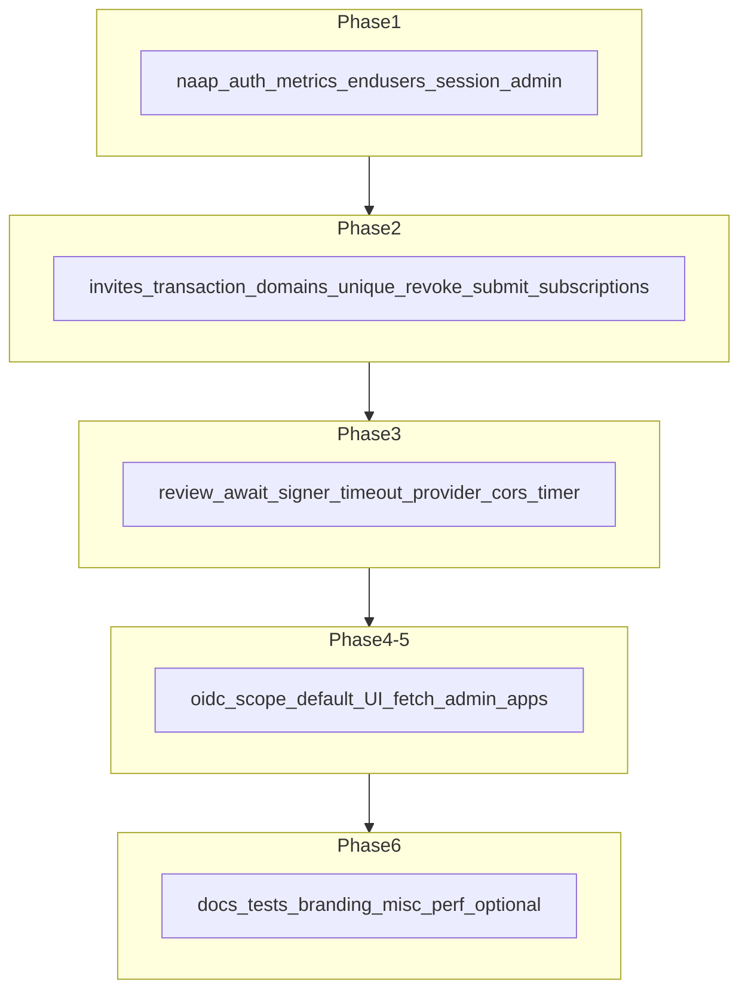

# Plan: PR #28 code review follow-ups

## Context

The PR thread includes an author self-review (billing race, users 404→401, custom domains TOCTOU, plans validation, programmatic tokens, API key audit logs, debug logs, scope fallback, TODO) marked as addressed. **CodeRabbit’s later review (commits `0fd806c` → `392825c`) adds a separate set of findings.** Spot-checks on the current workspace show several **CodeRabbit critical/major items are still open** (e.g. session branches without admin checks, missing `await` on `updateClientConfig`, no `(appId, domain)` uniqueness on [`appAllowedDomains`](src/db/schema.ts), invite redeem ordering).

Treat CodeRabbit’s list as the backlog; for each item, re-read the file and skip only if the fix is already merged on the branch.

---

## Phase 1 — Critical authorization (session path must match token path)

**Problem:** Several routes use `getServerSession` and return a user row on `sessionUser.id` alone, while the bearer path requires `admin` scope or role. That allows non-admin browser sessions to hit admin-only behavior.

| Location | Fix |
|----------|-----|
| [`src/app/api/v1/naap/auth/route.ts`](src/app/api/v1/naap/auth/route.ts) (`getAuthenticatedAdminUserId`, ~49–57) | Require admin on the session branch (e.g. `sessionUser.role === "admin"`), mirroring `hasScope(..., "admin")` on the token branch. Optionally still load `users` row to confirm existence. |
| [`src/app/api/v1/metrics/report/route.ts`](src/app/api/v1/metrics/report/route.ts) (`getAdminUser`, ~40–50) | Same: restrict session branch to admin role (and `typeof id === "string"`) before `db.select` from `users`. |
| [`src/app/api/v1/end-users/route.ts`](src/app/api/v1/end-users/route.ts) (`getAdminUser`, ~167–191) | Align with token path: require admin for session users (`sessionUser.role === "admin"` or `hasScope` on session-carried scopes—use whichever field NextAuth actually sets in this app, consistent with other admin routes). |

**Follow-up consistency:** CodeRabbit’s nitpick suggests extracting duplicated “session or token → admin user” logic used by [`src/app/api/v1/signer/cli-status/route.ts`](src/app/api/v1/signer/cli-status/route.ts) and [`src/app/api/v1/signer/logs/route.ts`](src/app/api/v1/signer/logs/route.ts). After Phase 1, consider one shared helper (e.g. under [`src/lib/auth.ts`](src/lib/auth.ts) or a small `admin-auth.ts`) so future fixes stay single-sourced.

---

## Phase 2 — Critical correctness / races

| Item | File(s) | Approach |
|------|---------|----------|
| **Atomic invite claim** | [`src/app/api/v1/admin/invites/route.ts`](src/app/api/v1/admin/invites/route.ts) (~73–97) | `db.transaction`: conditional `UPDATE admin_invites ... WHERE id = ? AND used_by IS NULL AND expires_at > now` returning rowcount; only if exactly one row updated, then `UPDATE users SET role = admin`. Reverse order if you prefer “claim first” but keep both in one transaction. |
| **Unique `(appId, domain)` + handler** | [`src/db/schema.ts`](src/db/schema.ts) (`appAllowedDomains`), new Drizzle migration under `drizzle/`, [`src/app/api/v1/apps/[id]/domains/route.ts`](src/app/api/v1/apps/[id]/domains/route.ts) | Add `uniqueIndex` on `(app_id, domain)`. On insert, catch Postgres unique_violation (driver-specific code / constraint name) and return **409** with a clear message. Keep optional pre-check for fast UX. |
| **Admin revoke stale read/write** | [`src/app/api/v1/admin/apps/[id]/revoke/route.ts`](src/app/api/v1/admin/apps/[id]/revoke/route.ts) | Fold `status = 'approved'` into the `UPDATE` `WHERE`; branch on affected rows (0 → 404/409 as appropriate). Reduces TOCTOU vs separate select + update. |
| **App submit race** (minor severity but same pattern) | [`src/app/api/v1/apps/[id]/submit/route.ts`](src/app/api/v1/apps/[id]/submit/route.ts) | Guarded update: `WHERE id = ? AND status = <expected>` + check `returning` / rowcount; **409** if concurrent transition. |
| **Subscription cancel ownership** | [`src/app/api/v1/subscriptions/route.ts`](src/app/api/v1/subscriptions/route.ts) (~101–107) | Add `eq(subscriptions.userId, userId)` to the cancel `UPDATE` WHERE for atomicity with the prior read. |

---

## Phase 3 — Major reliability / security-sensitive behavior

| Item | File(s) | Approach |
|------|---------|----------|
| **Missing `await` on OIDC client update** | [`src/app/api/v1/admin/apps/[id]/review/route.ts`](src/app/api/v1/admin/apps/[id]/review/route.ts) (~67–71) | `await updateClientConfig(...)` before clearing pending fields / DB update so success reflects actual provider config. |
| **Signer proxy hang** | [`src/lib/signer-proxy.ts`](src/lib/signer-proxy.ts) (`forwardToSigner`, ~81–92) | Reuse the same **AbortController + timeout** pattern as `syncSignerStatus()` (grep that function in the same file) on the internal `fetch` to `getSignerUrl`. |
| **Frozen CORS allowlist** | [`src/lib/oidc/provider.ts`](src/lib/oidc/provider.ts) (~227–308) | Today `buildCorsSnapshot()` runs once and `clientBasedCORS` closes over `corsSnapshot`. Options: (a) call `buildCorsSnapshot()` inside the CORS callback (simplest; measure DB load), or (b) short-TTL in-memory cache keyed by time. Goal: **DB changes to allowed domains / custom hosts apply without `resetProvider()`**. |
| **Duplicate cleanup timers** | [`src/lib/oidc/provider.ts`](src/lib/oidc/provider.ts) (~514–516) | Module-level timer id: `clearInterval` in `resetProvider` / before scheduling a new one; only one active interval. |

---

## Phase 4 — OIDC / token exchange consistency

| Item | File | Approach |
|------|------|----------|
| **Implicit `gateway` scope on token exchange** | [`src/app/api/v1/oidc/[...oidc]/route.ts`](src/app/api/v1/oidc/[...oidc]/route.ts) (~115) | Pass `exchangeParams.get("scope")` through without `|| "gateway"`; let [`handleTokenExchange`](src/lib/oidc/token-exchange.ts) (or equivalent) reject missing/empty scope if that is the policy—aligned with earlier removal of “empty scope → gateway” in auth paths. |

---

## Phase 5 — UI / client behavior

| Item | File | Approach |
|------|------|----------|
| **App detail fetch on 401/404** | [`src/app/apps/[id]/page.tsx`](src/app/apps/[id]/page.tsx) (~31–67) | Check `response.ok` before `json()`; on failure set `appData` null or dedicated error state; default **`canEdit` to false** unless success body explicitly allows edit. `.catch` → null. |
| **Admin apps page spinner when signed out** | [`src/app/admin/apps/page.tsx`](src/app/admin/apps/page.tsx) (effects ~43–57 and ~116–124 per review) | On `status === "unauthenticated"`, redirect (e.g. `/`) and `setLoading(false)`. |
| **Usage page: failed fetches** | [`src/app/apps/[id]/usage/page.tsx`](src/app/apps/[id]/usage/page.tsx) (~37–47) | Validate `res.ok` for both fetches; surface error state instead of silent malformed data. |
| **`formatWei` precision** | Same file (~22–28) | Replace `Number(bigint)` division with BigInt/string math (or a tiny shared formatter) so large wei values do not lose precision. |
| **Partial save messaging** | [`src/components/apps/AppSettingsScreen.tsx`](src/components/apps/AppSettingsScreen.tsx) (`saveChanges`, ~72–115) | If first PUT succeeds and second fails, error message should state **metadata saved vs OIDC settings failed** (or merge endpoints later—messaging is the minimal fix). |
| **Device page footer branding** | [`src/app/oidc/device/page.tsx`](src/app/oidc/device/page.tsx) (~63–68) | Route footer through the same branding resolver / component used on other OIDC pages so white-label does not leak “pymthouse”. |

---

## Phase 6 — Minor / docs / tests / polish

- **[`src/lib/oidc/adapter.test.ts`](src/lib/oidc/adapter.test.ts):** unique id per run or teardown for Postgres-shared DB.
- **[`docs/builder-api.md`](docs/builder-api.md):** clarify Basic vs Bearer: client_credentials + `users:token`, then Bearer on builder routes.
- **[`src/lib/oidc/branding-shared.ts`](src/lib/oidc/branding-shared.ts):** validate/normalize hex `primaryColor` before `adjustColorBrightness` / `...1a` suffix.
- **[`src/app/api/v1/subscriptions/route.ts`](src/app/api/v1/subscriptions/route.ts):** try/catch around `request.json()` → **400** on invalid JSON (same pattern as other routes if you add a small helper).
- **[`src/app/api/v1/apps/[id]/keys/route.ts`](src/app/api/v1/apps/[id]/keys/route.ts):** either filter `status = active` on GET or document that revoked keys are listed for audit.
- **[`src/lib/oidc/host-resolution.ts`](src/lib/oidc/host-resolution.ts):** dynamic scheme for non-canonical URLs; warn when falling back to `localhost` without host headers.
- **[`src/app/api/v1/apps/[id]/usage/route.ts`](src/app/api/v1/apps/[id]/usage/route.ts):** parse/validate date query params; compare as timestamps (or document ISO-only contract).

**Performance nits (defer or batch if scope is tight):** aggregate queries for [`src/app/signer/page.tsx`](src/app/signer/page.tsx), [`src/app/dashboard/page.tsx`](src/app/dashboard/page.tsx), [`src/app/users/page.tsx`](src/app/users/page.tsx), [`src/app/users/[id]/page.tsx`](src/app/users/[id]/page.tsx), and unbounded loads in [`src/lib/metrics.ts`](src/lib/metrics.ts). These are scalability improvements, not security blockers.

**Optional:** [`src/app/api/v1/naap/exchange/route.ts`](src/app/api/v1/naap/exchange/route.ts) redundant Bearer check—low value if deprecated.

---

## Verification

- Run **`npm test`** / **`npm run typecheck`** (or project equivalents) after auth and schema changes.
- After **schema/migration** for `app_allowed_domains`, run migrations against a test DB.
- For **UI changes** (app detail, admin apps, usage, device footer), verify in the browser once implementation is complete (per workspace rule: Browser DevTools MCP for web verification).

---

## Suggested implementation order

