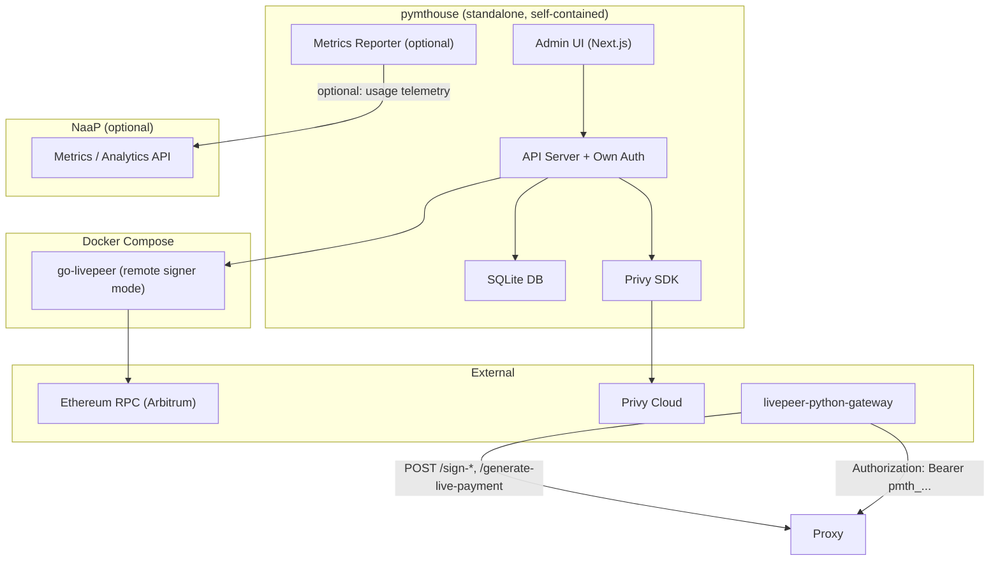
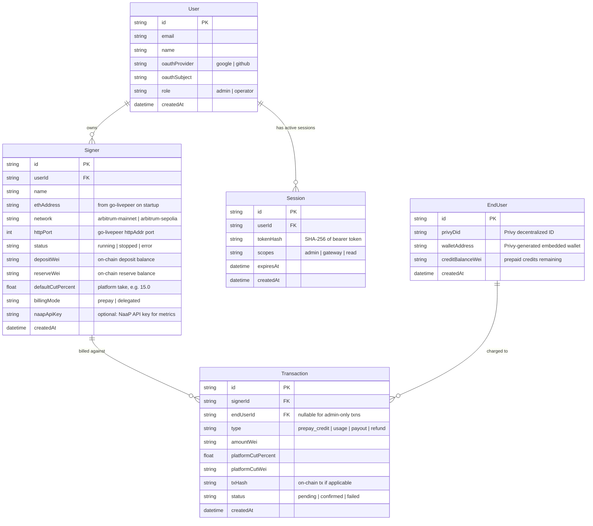
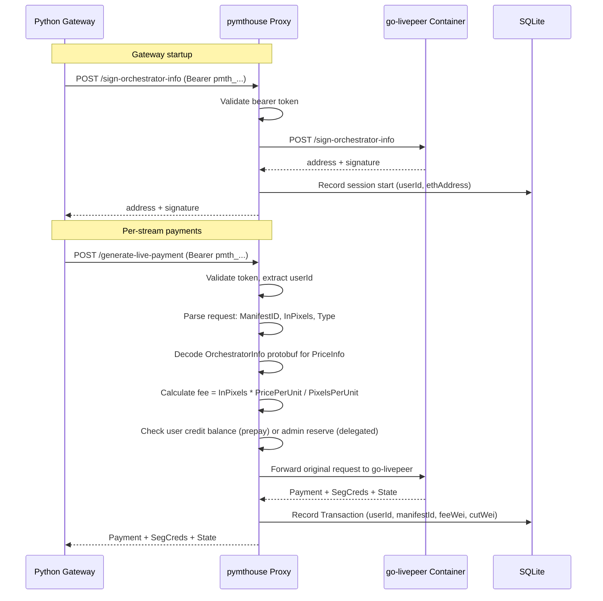
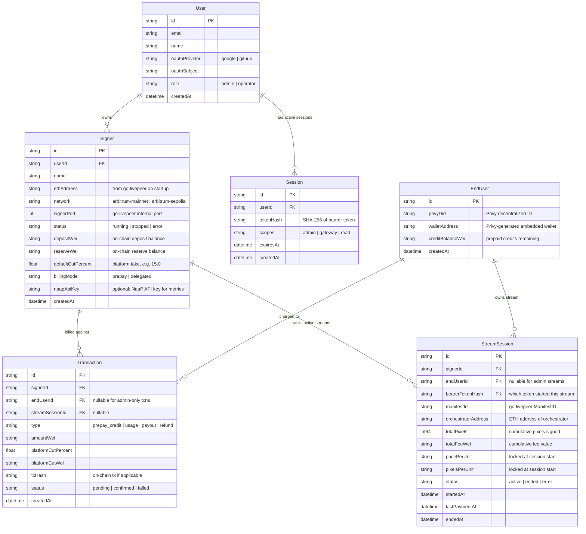

# pymthouse -- Livepeer Payment Clearinghouse

## Critical Design Constraint

**Projects and API keys live in NaaP, not pymthouse.** After a pymthouse instance is deployed, the operator can optionally create a Project + API keys inside NaaP for metrics/analytics reporting. These NaaP API keys are used *only* for telemetry -- pymthouse has **zero operational dependency on NaaP** after deployment. pymthouse issues its own OAuth bearer tokens for its own admin users and gateway operators.

```
Ownership boundary:

  NaaP (optional metrics)              pymthouse (standalone)
  ┌─────────────────────┐              ┌───────────────────────────┐
  │ Project             │   reports    │ User (admin OAuth)        │
  │   └─ ApiKey(s)      │◄────────────│ Signer (go-livepeer)      │
  │      (metrics only) │  telemetry  │ Session / Bearer Tokens   │
  │                     │             │ Transaction (billing)     │
  │ Project:Signer=M:1  │             │ EndUser (Privy wallets)   │
  │ ApiKey:Project=M:1  │             │                           │
  └─────────────────────┘              └───────────────────────────┘
```

## Architecture Overview

pymthouse is a standalone Node.js + TypeScript application that wraps a `go-livepeer` remote signer node in Docker and provides:

- An admin UI for managing signers, users, and billing
- OAuth login for admin users (NextAuth.js) with pymthouse-issued bearer tokens
- Privy integration for end-user ephemeral wallets and payments
- A percentage-cut billing model between the signer admin and end users
- Optional metrics reporting to NaaP via NaaP-issued API keys
- Ansible-based deployment to any Linux host (playbook lives in naap)




## Data Model

### pymthouse SQLite (local, self-contained)

SQLite via [better-sqlite3](https://github.com/WiseLibs/better-sqlite3) (synchronous, zero-config, single-file, pairs well with go-livepeer's own SQLite usage).




### NaaP side (existing, for optional metrics only)

These entities already exist or will be added to NaaP. pymthouse never reads/writes them directly -- it only sends telemetry via HTTP.

- **Project** -- created in NaaP after pymthouse deployment, references a signer by ethAddress/endpoint
  - Project : Signer = many : 1
- **ApiKey** -- NaaP-issued, used by pymthouse's MetricsReporter to POST usage data
  - ApiKey : Project = many : 1

## Tech Stack

- **Framework**: Next.js 15 (App Router) -- full-stack: API routes + React admin UI in one process
- **Database**: SQLite via better-sqlite3 -- zero-config, single file, pairs with go-livepeer's SQLite
- **ORM/Migrations**: Drizzle ORM (SQLite driver) -- lightweight, type-safe, no codegen step
- **Admin Auth**: NextAuth.js (Google/GitHub OAuth) -- admin login, pymthouse issues its own bearer tokens
- **User Wallets**: Privy React SDK + Server SDK -- ephemeral wallets for end users
- **Remote Signer**: go-livepeer Docker container -- official image, `-remoteSigner` mode
- **Infra**: Docker Compose -- go-livepeer + (optionally) pymthouse itself
- **Deployment**: Ansible playbook (in naap repo) -- generic Linux host deployment

## Project Structure -- `/home/elite/repos/pymthouse/`

```
pymthouse/
  package.json
  tsconfig.json
  next.config.ts
  docker-compose.yml            # go-livepeer remote signer container (internal port only)
  drizzle.config.ts             # Drizzle ORM config
  .env.example                  # Template for secrets
  proto/
    lp_rpc.proto                # Vendored from go-livepeer/net/ (OrchestratorInfo, PriceInfo, TicketParams)
  src/
    app/
      layout.tsx                # Root layout with Privy + NextAuth providers
      page.tsx                  # Dashboard home
      login/page.tsx            # OAuth login page
      signers/
        page.tsx                # List/manage signers
        [id]/page.tsx           # Signer detail (deposit, reserve, status, stream sessions)
      streams/
        page.tsx                # Active + historical stream sessions
      users/
        page.tsx                # End-user list (Privy-managed)
      billing/
        page.tsx                # Transaction log, cut configuration
      api/
        auth/[...nextauth]/route.ts   # NextAuth OAuth handlers
        v1/
          signers/route.ts            # CRUD signers (admin auth)
          tokens/route.ts             # Issue/revoke bearer tokens (admin auth)
          billing/route.ts            # Transaction log, balance queries
          health/route.ts             # App health check
          metrics/report/route.ts     # Outbound: push telemetry to NaaP (optional)
        signer/
          sign-orchestrator-info/route.ts   # Proxy: auth + forward to go-livepeer
          generate-live-payment/route.ts    # Proxy: auth + value tracking + forward
    db/
      schema.ts                 # Drizzle schema (User, Session, Signer, EndUser, StreamSession, Transaction)
      index.ts                  # DB connection (better-sqlite3)
      migrate.ts                # Migration runner
    lib/
      auth.ts                   # NextAuth config + bearer token issuance/validation
      privy.ts                  # Privy server SDK setup
      signer-proxy.ts           # Reverse proxy: validate token, parse request, calculate fee, forward, record
      proto.ts                  # Decode OrchestratorInfo protobuf, extract PriceInfo
      billing.ts                # Cut calculation, credit balance checks
      metrics.ts                # Optional NaaP metrics reporter (uses NaaP API key)
    components/
      SignerCard.tsx
      StreamSessionTable.tsx
      UserTable.tsx
      TransactionLog.tsx
      DashboardLayout.tsx
```

## Critical Architecture Decision: Proxy-Based Auth + Value Tracking

### Why pymthouse must proxy the remote signer

The go-livepeer remote signer has **zero authentication** on its HTTP endpoints. It relies entirely on network-level security. Its two endpoints (`/sign-orchestrator-info` and `/generate-live-payment`) are unauthenticated, unmetered, and have no concept of users.

pymthouse solves this by acting as a **reverse proxy** in front of the go-livepeer container. The gateway's `-remoteSignerUrl` points at pymthouse, not directly at go-livepeer. This gives pymthouse the ability to:

1. **Authenticate** every request via OAuth bearer tokens
2. **Track per-user value** by inspecting the `ManifestID`, pixel count, and price from each payment request
3. **Apply billing** (percentage cut, credit checks) before forwarding to go-livepeer
4. **Record transactions** in SQLite for every payment signed




### What pymthouse can extract from each proxied request

The `RemotePaymentRequest` body (JSON) contains everything needed for value tracking without modifying go-livepeer:


| Field          | Source             | What pymthouse extracts                                              |
| -------------- | ------------------ | -------------------------------------------------------------------- |
| `ManifestID`   | JSON field         | Stream session identifier -- maps to userId via Session table        |
| `InPixels`     | JSON field         | Pixel count for this payment interval                                |
| `Type`         | JSON field         | Job type (`lv2v` = live video-to-video)                              |
| `Orchestrator` | Protobuf bytes     | Decode to get `PriceInfo.pricePerUnit` and `PriceInfo.pixelsPerUnit` |
| `State`        | Opaque signed blob | Passed through unmodified (pymthouse cannot read/modify it)          |


**Fee calculation** (same formula as go-livepeer):

```
feeWei = InPixels * (PricePerUnit / PixelsPerUnit)
platformCutWei = feeWei * (cutPercent / 100)
```

For lv2v with no explicit `InPixels`, pymthouse can replicate go-livepeer's calculation:

```
pixelsPerSec = 1280 * 720 * 30 = 27,648,000
pixels = pixelsPerSec * secondsSinceLastUpdate
```

### What the State blob contains (for reference, pymthouse does not modify it)

go-livepeer's `RemotePaymentState` (signed with the signer's ETH key):

- `StateID` -- unique session identifier
- `PMSessionID` -- payment manager session
- `LastUpdate` -- timestamp of last payment
- `OrchestratorAddress` -- which orchestrator is being paid
- `SenderNonce` -- ticket nonce counter
- `Balance` -- remaining credit balance (rational number as string)
- `InitialPricePerUnit` / `InitialPixelsPerUnit` -- price locked at session start

pymthouse passes this blob through transparently. It cannot read or tamper with it (signature verification would fail on the go-livepeer side).

## Updated Data Model




**New table: `StreamSession**` -- tracks every active stream through the proxy. Created on first `/generate-live-payment` call for a new ManifestID, updated on each subsequent call. This is the bridge between OAuth identity and go-livepeer payment value.

## Key Flows

### 1. Admin creates a Signer

1. Admin logs in via OAuth (NextAuth) -- pymthouse issues a session bearer token
2. Admin clicks "New Signer" -- picks a name + network (arbitrum-mainnet / sepolia)
3. API writes a `Signer` row, spins up go-livepeer container via Docker Compose (or uses a pre-running one mapped to a port)
4. go-livepeer auto-generates an ETH wallet key on first startup
5. pymthouse queries `GET /status` on the signer container (internal port, localhost) to read back the `ethAddress`
6. Admin funds deposit + reserve via the signer's CLI API (`/fundDepositAndReserve`)

### 2. Python gateway configures remote signer URL pointing at pymthouse

1. Admin creates a bearer token with `gateway` scope in pymthouse admin UI
2. Python gateway is configured with `remote_signer_url = "https://pymthouse.example.com"` and the `pmth_...` bearer token
3. Python gateway sends `Authorization: Bearer pmth_...` on every request to pymthouse's proxy endpoints
4. pymthouse validates the token, proxies authenticated requests to the internal go-livepeer container

**Auth header delivery:** The project uses a **livepeer-python-gateway** (not go-livepeer's built-in gateway). Since we control the Python gateway code, it sends `Authorization: Bearer pmth_...` on every request to the remote signer URL. No patches to go-livepeer are needed.

### 3. Proxied payment flow (per-stream value tracking)

1. Gateway calls `POST /sign-orchestrator-info` through pymthouse proxy
2. pymthouse validates bearer token, forwards to go-livepeer, records session start
3. Gateway calls `POST /generate-live-payment` with ManifestID + OrchestratorInfo protobuf
4. pymthouse:
  - Validates bearer token, resolves to userId
  - Parses `ManifestID` from request JSON
  - Decodes `Orchestrator` protobuf to extract `PriceInfo` (pricePerUnit, pixelsPerUnit)
  - Reads `InPixels` or calculates from `Type=lv2v` (1280x720x30 * seconds)
  - Calculates `feeWei = pixels * pricePerUnit / pixelsPerUnit`
  - Upserts `StreamSession` row (keyed by ManifestID) -- accumulates totalPixels, totalFeeWei
  - Checks credit balance (prepay mode) or admin reserve (delegated mode)
  - Forwards the original unmodified request body to go-livepeer container
5. go-livepeer signs the tickets and returns `{ payment, segCreds, state }`
6. pymthouse records a Transaction row, returns the response to gateway unmodified

### 4. End-user payment (Privy ephemeral wallets)

1. End user authenticates via Privy embedded login (social login -> embedded wallet)
2. User pre-pays credits or pymthouse delegates from the admin signer's deposit
3. pymthouse records the Transaction with `platformCutPercent` applied
4. Periodic settlement: pymthouse reconciles on-chain ticket payments vs. user credits

### 5. Optional NaaP metrics reporting

1. After deploying pymthouse, operator creates a Project + API key in NaaP
2. Operator pastes the NaaP API key into pymthouse's Signer config (`naapApiKey` field)
3. pymthouse's MetricsReporter periodically POSTs usage telemetry to NaaP (session counts, ticket volumes, uptime)
4. If no NaaP API key is configured, pymthouse operates identically -- just without telemetry

## Implementation Order

### Phase 1: Scaffold + Docker + Signer Proxy (get go-livepeer running behind pymthouse)

- Initialize Next.js project in `/home/elite/repos/pymthouse`
- Create `docker-compose.yml` with go-livepeer remote signer service (internal port only, not exposed)
- Create SQLite schema with Drizzle (User, Session, Signer, EndUser, StreamSession, Transaction)
- Build `src/lib/signer-proxy.ts` -- reverse proxy that:
  - Validates bearer token on incoming requests
  - Parses `RemotePaymentRequest` JSON + decodes `OrchestratorInfo` protobuf (using `protobufjs`)
  - Calculates fee from pixels + price
  - Forwards to internal go-livepeer container
  - Records StreamSession + Transaction in SQLite
- Health endpoint at `/api/v1/health`

### Phase 2: Admin Auth + Bearer Tokens + CRUD UI

- NextAuth.js with Google + GitHub providers for admin OAuth login
- pymthouse-issued bearer tokens (stored as SHA-256 hashes in Session table, `pmth_` prefix)
- Admin pages: Signers list/detail, stream sessions log, end-user list, billing config
- API routes for signer CRUD, token issuance/revocation

### Phase 3: Protobuf Decoding + Value Tracking

- Vendor or generate TypeScript types from `go-livepeer/net/lp_rpc.proto` (OrchestratorInfo, PriceInfo, TicketParams)
- Full fee calculation in the proxy path
- StreamSession accumulation (totalPixels, totalFeeWei per ManifestID)
- Admin dashboard: real-time stream sessions, cumulative value signed

### Phase 4: Privy + Billing

- Privy React SDK for end-user login (separate from admin OAuth)
- Privy Server SDK for embedded wallet creation
- Credit balance checks in proxy path (prepay mode)
- Transaction recording with percentage cut
- Billing dashboard in admin UI

### Phase 5: Optional NaaP Metrics Reporter

- `src/lib/metrics.ts` -- HTTP client that POSTs telemetry to NaaP using NaaP-issued API keys
- Configured per-signer via `naapApiKey` field (null = disabled)
- NaaP side: ensure the existing usage-summary / metrics ingestion endpoints accept this data

### Phase 6: Ansible Deployment (in naap repo)

- Generic Ansible role at `/home/elite/repos/naap/deploy/ansible/roles/pymthouse/`
- Playbook: install Docker, pull go-livepeer image, deploy pymthouse, configure nginx/caddy reverse proxy, TLS via Let's Encrypt
- Inventory template for any Linux host

